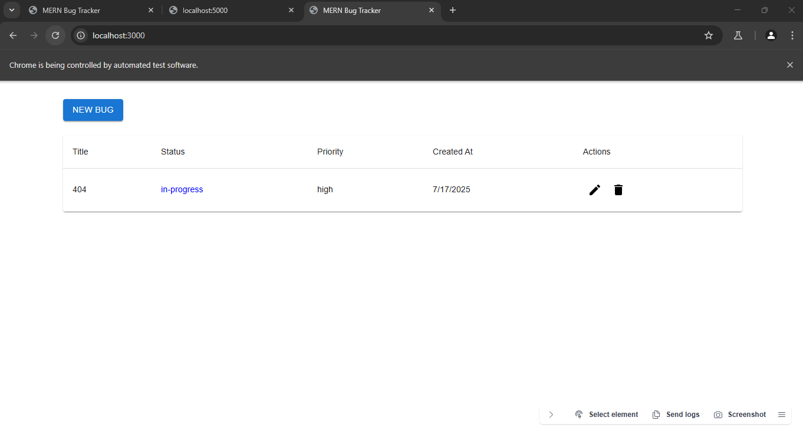
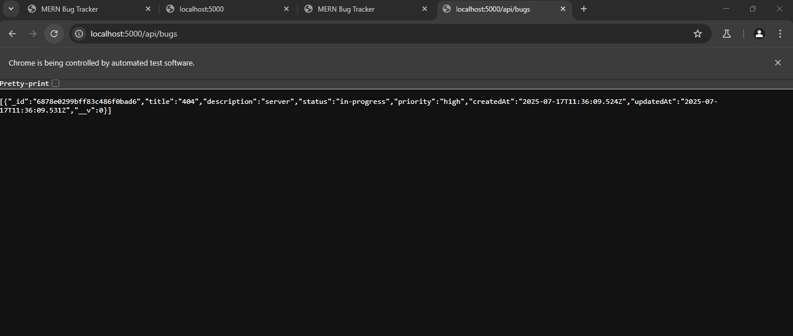
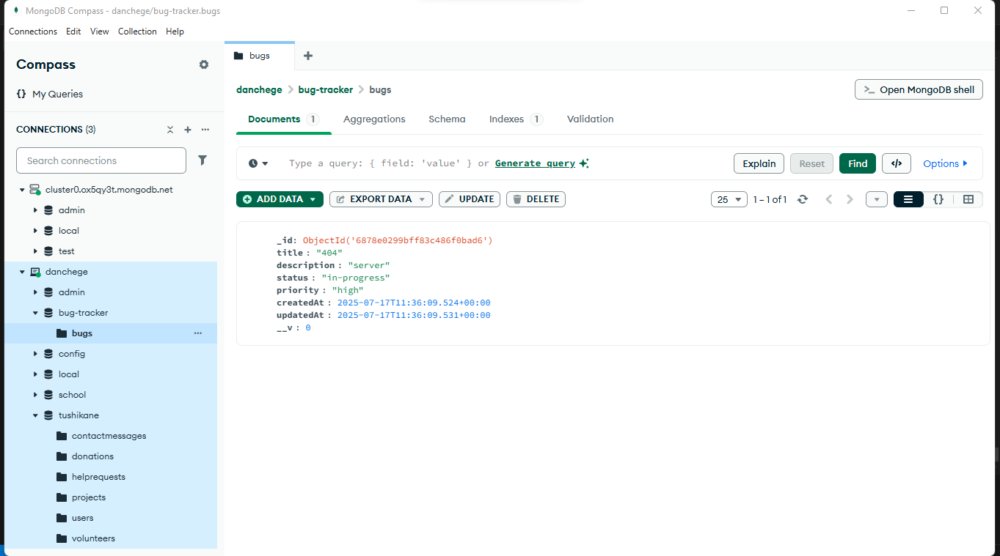

# MERN Bug Tracker

Created by Daniel Chege

A full-stack bug tracking application built with MERN stack (MongoDB, Express.js, React, Node.js).

## Features

- Report new bugs with detailed information
- View list of all reported bugs
- Update bug statuses (Open, In Progress, Resolved)
- Delete bugs
- Comprehensive testing coverage
- Error handling and debugging support
- User authentication and authorization
- Real-time bug updates
- Search and filter functionality

## Screenshots

### Frontend Interface


### Backend API


### MongoDB Compass


## Project Structure

```
mern-bug-tracker/
├── backend/          # Node.js/Express backend
│   ├── config/      # Configuration files
│   ├── controllers/ # API controllers
│   ├── models/      # MongoDB models
│   ├── routes/      # API routes
│   └── middleware/  # Custom middleware
├── frontend/         # React frontend
│   ├── src/
│   │   ├── components/  # Reusable React components
│   │   ├── pages/      # Page components
│   │   ├── services/   # API services
│   │   └── utils/      # Utility functions
└── README.md
```

## Setup Instructions

### Important Note
This repository excludes large files like `node_modules` and build directories to keep the repository size manageable. These files will be automatically recreated when you set up the project locally.

### Prerequisites

- Node.js (v14 or higher)
- MongoDB (local or Atlas)
- pnpm (recommended package manager)

### Cloning and Setup

1. Clone the repository:
   ```bash
   git clone https://github.com/danchege/MERN-bug-Tracker.git
   cd MERN-bug-Tracker
   ```

2. Install dependencies:
   ```bash
   # Backend
   cd backend
   pnpm install
   
   # Frontend
   cd ../frontend
   pnpm install
   ```

3. Set up environment variables:
   ```bash
   # In backend directory
   cp test-env.js .env
   # Edit .env with your MongoDB connection string
   ```

4. Start the servers:
   ```bash
   # In backend directory
   pnpm dev
   
   # In a new terminal, in frontend directory
   pnpm start
   ```

The application will be available at http://localhost:3000

### Backend Setup

1. Navigate to backend directory:
   ```bash
   cd backend
   ```

2. Install dependencies:
   ```bash
   pnpm install
   ```

3. Create a .env file with:
   ```
   MONGODB_URI=mongodb://localhost:27017/bug-tracker
   PORT=5000
   ```

4. Start the backend server:
   ```bash
   pnpm dev
   ```

The backend server will run on http://localhost:5000

### Frontend Setup

1. Navigate to frontend directory:
   ```bash
   cd frontend
   ```

2. Install dependencies:
   ```bash
   pnpm install
   ```

3. Start the development server:
   ```bash
   pnpm start
   ```

## Running Tests

### Backend Tests

1. Navigate to backend directory
2. Run tests:
   ```bash
   npm test
   ```

### Frontend Tests

1. Navigate to frontend directory
2. Run tests:
   ```bash
   npm test
   ```

## Debugging

### Backend Debugging

1. Use Node.js inspector:
   ```bash
   node --inspect-brk server.js
   ```
   Then open Chrome DevTools with:
   ```
   chrome://inspect
   ```

2. Add console.log statements for tracking values
3. Use Postman for API testing

### Frontend Debugging

1. Use Chrome DevTools:
   - Network tab for API calls
   - Console tab for errors
   - Sources tab for debugging

2. Use React Developer Tools extension
3. Add console.log statements in components

## Error Handling

- Backend: Express error middleware for API errors
- Frontend: Error boundaries for component errors
- Comprehensive error logging
- User-friendly error messages

## Testing Approach

### Backend Tests

- Unit tests for helper functions
- Integration tests for API endpoints
- Database mocking with jest-mongodb
- Test coverage monitoring

### Frontend Tests

- Unit tests for components
- Integration tests for API interactions
- UI state testing
- Error boundary testing

## Contributing

1. Fork the repository
2. Create a feature branch
3. Commit your changes
4. Push to the branch
5. Create a Pull Request

## License

MIT
